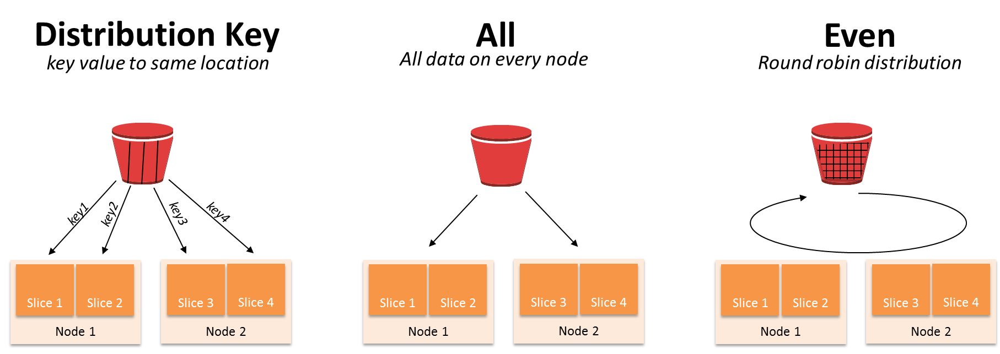

# AWS Redshift para Manejo de Big Data

Escuela: 🐱‍💻Data Science
\
Estado: ✔️Finalizado
\
Fecha de Creación: August 3, 2021 4:00 PM

- **Primeros Pasos**
    - **¿Qué es un Data Warehouse?**
        - Es una base de datos que recibe información de muchas fuentes de datos.
        - Su objetivo es unificar la información para ayudar a la analítica de la empresa.
        - Se usa el proceso de ETL (extract, transform, load) para alimentar el Data Warehouse.
        - Extraer: Obtener los datos de las distintas bases de datos
        - Transformar: Realizar una limpieza y modificación de los datos, creando una buena estructura analítica.
        - Cargar: Luego de transformar los datos, se cargar al DW
        
        **¿Que es una estructura analítica?**Depende de la organización pero el estandar es el modelo dimensional, que posee:
        
        - Tabla de hechos: Que quiero medir
        - Tabla de dimensiones: Como medirlo, es decir, que variables son importante para generar los análisis
        
        
        
        Otro ejemplo seria en una consulta médica, donde la tabla de hechos es la tabla de consultas.
        
        
        
        
        
        **Arquitectura del data warehouse**
        ● Tablas de hechos
        
        Contienen la información que queremos
        medir / analizar.
        
        ● Tablas de dimensiones
        
        Contienen la información del “cómo” lo
        quiero medir.
        
        
        
        El modelo que usaremos en Redshift:
        
    - **Bases de datos columnares y arquitectura orientada a optimización de consultas**
        - Base de datos relacional: Orientada a la alta transaccionalidad
        - Base de datos columnas: Orientada a la analítica
        
        Amazon Redshift es un servicio de almacén de datos completamente administrado, empresarial y de varios petabytes.
        
        Esta guía se centra en el uso de Amazon Redshift para crear y administrar un data warehouse. Si trabaja con bases de datos como diseñador, desarrollador de software o administrador, le proporciona la información que necesita para diseñar, desarrollar, hacer consultas y mantener el data warehouse.
        
        Excelentes para aplicaciones de analítica.
        ● En redshift cada columna se almacena en bloques de 1 MB.
        ● Una consulta a una tabla de 10 columnas de las cuales solo requiero 2, leería únicamente las 2 necesarias.
        
        Integración total con AWS.
        ● La base de datos más rápida en la nube.
        ● Los costos más bajos en la nube.
        ● Alta escalabilidad.
        ● Clientes SQL.
        
        Dbeaver: la usaremos para procesar nuestras DBs en redshift:
        
    - **¿Cómo funciona AWS Redshift?**
        
        El secreto es repartir el trabajo, no se instala en un único servidor sino que se instala en un clúster(arreglos de varios servidores conectados **NODOS**)
        
        **Nos conectamos a un nodo líder.**
        
        El cual organiza y asigna las tareas a los otros nodos. (Tareas en paralelos)El nodo seguidor
        
        Y cada nodo seguidor reparte su tarea entre sus Slides. Para trabajar la tarea asignada por el nodo lider en paralelo.
        
        La base de redshift es PostgreSQL.
        
        
        
        **Documentación:**
        
        [https://docs.aws.amazon.com/redshift/latest/dg/c_high_level_system_architecture.html](https://docs.aws.amazon.com/redshift/latest/dg/c_high_level_system_architecture.html)
        
- **Configurando el entorno**
    - **Creando nuestro entorno de trabajo en AWS**
        
        
        [Primero ingresamos a la consola de administración de aws](https://us-east-2.console.aws.amazon.com/console/home?region=us-east-2#) y creamos un rol IAM
        
        
        
        Ahora creamos un bucket de datos para S3
        
        
        
        Un bucket es un contenedor de objetos. Un objeto es un archivo y cualquier metadato que describa ese archivo. Para almacenar un objeto en Amazon S3, cree un bucket y, a continuación, cargue el objeto en el bucket.
        
    - **Crear el cluster de trabajo y los nodos**
        
        Dentro de la consola de AWS buscamos redshift y seleccionamos crear cluster
        
        
        
        Se puede crear cluster en la versión trial para aprendizaje con un solo nodo, en el curso usamos un cluster dc2.large de dos nodos, que cuesta con cada TB de transacción pero por el volumen que trabajaremos en el curso, no tendrá costo.
        
        Una vez tengamos configurado y disponible nuestro cluster podremos paralelizar nuestros trabajos, cada consulta y labor con la base de datos para trabajar con ella.
        
        
        
    - **Consumiendo Redshift: Conectando con un cliente externo de SQL**
        
        Dentro de la consola de AWS primero debemos hacer una serie de configuraciones en las propiedades del cluster que creamos en la clase anterior.
        
        Primero debemos permitir el acceso público a nuestro cluster:
        
        
        
        E ingresar al VPC security group para obtener reglas de entrada y salida con las que conectaremos
        
        Editamos una regla de entrada y agregamos una con el puerto por default de redshift para cualquier conexión (para efectos del curso se permite acceso desde cualquier conexión, pero en la realidad, debemos especificas las IPs que permitiremos.)
        
        
        
        Regresando al cluster, veremos que en este apartado encontraremos los detalles de conexión.
        
        
        
        En este curso usaremos DBeaver como editor SQL y le pasaremos el ODBC URL para conectarnos al cluster (el "enlace" tiene cada uno de los campos que debes ingresar en el formulario de creación de la conexión de DBeaver).
        
        
        
        Con esto ya podremos ejecutar sentencias SQL dentro de DBeaver conectadas al redwshift
        
        ```sql
        select 'hola mundo!' texto;
        
        create table estudiante(
        id int2,
        nombre varchar(30),
        pais_id int2
        );
        
        create table pais(
        pais_id int2,
        nombre varchar(60)
        );
        
        insert into estudiante values (1,'David',1),(2,'Ange',1),(3,'Felipe',2);
        insert into pais values (1,'Colombia'),(3,'Mexico');
        
        select * from estudiante e
        inner join pais p
        on e.pais_id = p.pais_id;
        
        select * from estudiante e
        left join pais p
        on e.pais_id = p.pais_id;
        
        drop table pais;
        drop table estudiante;
        ```
        
    - **Sentencias SQL en Redshift**
        
        En esta clase realizamos un ejemplo para cargar bases de datos con su información en AWS. Primero usamos unas sentencias SQL en DBeaver para crear las 7 tablas de nuestro proyecto de prueba, el código de este proceso es este: [https://github.com/alarcon7a/redshift_course/tree/master/Tickit_db](https://github.com/alarcon7a/redshift_course/tree/master/Tickit_db)
        
        **Creando las tablas:**
        
        ```sql
        create table users(
        	userid integer not null distkey sortkey,
        	username char(8),
        	firstname varchar(30),
        	lastname varchar(30),
        	city varchar(30),
        	state char(2),
        	email varchar(100),
        	phone char(14),
        	likesports boolean,
        	liketheatre boolean,
        	likeconcerts boolean,
        	likejazz boolean,
        	likeclassical boolean,
        	likeopera boolean,
        	likerock boolean,
        	likevegas boolean,
        	likebroadway boolean,
        	likemusicals boolean);
        
        create table venue(
        	venueid smallint not null distkey sortkey,
        	venuename varchar(100),
        	venuecity varchar(30),
        	venuestate char(2),
        	venueseats integer);
        
        create table category(
        	catid smallint not null distkey sortkey,
        	catgroup varchar(10),
        	catname varchar(10),
        	catdesc varchar(50));
        
        create table date(
        	dateid smallint not null distkey sortkey,
        	caldate date not null,
        	day character(3) not null,
        	week smallint not null,
        	month character(5) not null,
        	qtr character(5) not null,
        	year smallint not null,
        	holiday boolean default('N'));
        
        create table event(
        	eventid integer not null distkey,
        	venueid smallint not null,
        	catid smallint not null,
        	dateid smallint not null sortkey,
        	eventname varchar(200),
        	starttime timestamp);
        
        create table listing(
        	listid integer not null distkey,
        	sellerid integer not null,
        	eventid integer not null,
        	dateid smallint not null  sortkey,
        	numtickets smallint not null,
        	priceperticket decimal(8,2),
        	totalprice decimal(8,2),
        	listtime timestamp);
        
        create table sales(
        	salesid integer not null,
        	listid integer not null distkey,
        	sellerid integer not null,
        	buyerid integer not null,
        	eventid integer not null,
        	dateid smallint not null sortkey,
        	qtysold smallint not null,
        	pricepaid decimal(8,2),
        	commission decimal(8,2),
        	saletime timestamp);
        ```
        
        **llaves de distribución y ordenamiento distkey sortkey:** Notemos que aparecen dos componentes que no conocíamos antes, estos servirán para realizar consultas más efectivas con los IDs claves de la db
        
        Posteriormente deberemos **cargar los datos de cada tabla de manera correspondiente**, en el repositorio de tickitdb existe una carpeta con archivos planos con la información a cargar, este es un ejemplo de allevents_pipe.txt
        
        ```
        1|305|8|1851|Gotterdammerung|2008-01-25 14:30:00
        2|306|8|2114|Boris Godunov|2008-10-15 20:00:00
        3|302|8|1935|Salome|2008-04-19 14:30:00
        4|309|8|2090|La Cenerentola (Cinderella)|2008-09-21 14:30:00
        5|302|8|1982|Il Trovatore|2008-06-05 19:00:00
        6|308|8|2109|L Elisir d Amore|2008-10-10 19:30:00
        7|309|8|1891|Doctor Atomic|2008-03-06 14:00:00
        8|302|8|1832|The Magic Flute|2008-01-06 20:00:00
        ............................................................
        ```
        
        Para cargar los datos debemos subirlos primero a nuestro bucket de S3 (simplemente los arrastramos desde la carpeta)
        
        
        
        Tengamos presente que la ruta en s3 que se encuentra es s3://nuestrobucket/carpeta/archivo.txt
        
        Finalmente debemos **comunicar cada unade nuestras tablas vacías con sus datos correspondientes en S3**, esto lo haremos con SQL desde DBeaver a través de típicos copies que realizabamos en PostgreSQL, este es un ejemplo del archivo copy_s3_to_redshift_tickit.sql:
        
        ```sql
        copy users from 's3://<Reemplazar_con_la_ruta_del_bucket>/tickit/allusers_pipe.txt' 
        credentials 'aws_iam_role=<Reemplazar_con_tu_iam_role_arn>' 
        delimiter '|' region '<Reemplazar_con_tu_aws_region>';
        
        copy users from 's3://mibucketredshiftsalda/tickitdb/allusers_pipe.txt' 
        credentials 'aws_iam_role=arn:aws:iam::705146719858:role/MiRolRedshift' 
        delimiter '|' region 'us-east-2';
        ```
        
        Notemos que debemos incluir nuestra ruta s3, nuestro arn rol del cluster y la región en la que se encuentra
        
        Ya con esto tendremos finalmente nuestra tablas con los datos, lo comprobamos al realizar queries en DBeaver:
        
        
        
- **Cómo diseñar tu base de datos para mejorar su desempeño**
    - **¿Qué es la compresión en Redshift? Tipos de codificación**
        
        Tengo un archivo con X peso y quiero hacer que pese menos sin perder calidad.
        
        Una tabla en reshift que no este comprimida, esta perdiendo todo el poder.
        
        - Es una operacion dirigida a las columnas.
        - Reduce el tamanio en almacenamiento de los datos reduciendo el I/O.
        - Las consultas son mas veloces en una columna comprimida.
        
        La sentencia que utiliza redshift es la siguiente AL MOMENTO DE CREAR LA TABLA:
        
        CREATE TABLE table_name (column_name data type ENCODE encoding type)
        
        **Ejemplo:**
        
        **CREATE TABLE test_compresion (nombre varchar(30) ENCODE TEXT255)**
        
        **TIPOS DE COMPRENSION:**
        
        - Codificar **RAW** (Predeterminada de Redshift)
            - Los datos se almacenan descomprimidos y sin formato.
            - Tipos da datos: todos.
            - Tipo de codificacion por defecto.
        - Codificacion **AZ64**
            - Codificacion propia de Amazon (AWS).
            - Tipos de dato: smallint, integer, bigint, decimal, date, timestamp, timestamptz.
            - Utiliza SIMD (Single Instruction, Multiple Data) para procesamiento paralelo.
        - Codificacion por **diccionario de bytes**:
            - Muy eficaz cuando una columna tiene una cantidad limitada de valores unicos (menos de 256).
            - Crea un diccionario en un bloque de redshift de 1MB.
            - Tipos de dato: smallint, integer, bigint, decimal, real, double precision, char, varchar, date, timestamp, timestamptz.
        - Codificacion **Delta**:
            - Muy utiles para las columnas con formato fecha y hora.
            - Guarda la diferencia entre un registro y el siguiente.
            - Tipos de datos: smallint, int, bigint, date, timestamp, decimal.
            - Existe Delta de un byte y de dos bytes 8 y 16 respectivamente.
            - No se pueden superar estos bytes en la diferencia, de ser asi la codificacion no se aplica.
            - El rango de 1 byte abarca desde -127 hasta 127 y el rango de 2 bytes desde -32K hasta 32K.
            
            
            
        - Codificacion **LZO**:
            - Muy util para largas cadenas de texto.
            - Funciona para texto libre.
            - Tipos de dato: smallint, integer, bigint, decimal, char, varchar, date, timestamp, timestamptz.
        - Codificación **Mostly:**
            - Se utiliza cuando la mayoría de los datos de una columna son mejores en bits al valor de la columna misma.
            - Existe mostly de 8, 16 y 32 bits.
            - Tipos de dato: smallint, int, bigint, decimal.
        - Codificación **Runlength:**
            - Reemplaza un valor que se repite de manera consecutiva por un valor y por un recuento de la cantidad de números
            consecutivos.
            - Idea para una tabla en la que los valores de datos suelen repetirse de manera consecutiva.
            - Tipos de dato: smallint, integer, bigint, decimal, real, double precision, boolean, char, varchar, date, timestamp, timestamptz.
            
            
            
        - Codificación **Text255 y Text32k:**
            - Son útiles para comprimir columnas VARCHAR en las que se repiten con frecuencia las mismas palabras.
            - Text255 usa las 245 palabras más frecuentes de la columna y crea un diccionario.
            - Text32k hace lo mismo pero indexa palabras hasta tener un diccionario de 32k.
        - Codificación **Zstandard:**
            - La codificación ZSTD funciona especialmente bien para las columnas CHAR y VARCHAR.
            - Es muy poco probable que ZSTD aumente el uso del disco.
            - Tipos de dato: smallint, integer, bigint, decimal, real, double, precision, boolean, char, varchar, date, timestamp, timestamptz.
        - **Comparativa de codificaciones**
            
            
            
        
        [Trabajar con compresión de columnas](https://docs.aws.amazon.com/es_es/redshift/latest/dg/t_Compressing_data_on_disk.html)
        
    - **Aplicando algoritmos de compresión**
        
        Vamos a evaluar los algorítmos de compresión con nuestros datos del proyecto del curso
        
        ```sql
        create  table cartesian_venue as (
        select venueid, venuename, venuecity, venuestate, venueseats
        from venue, listing);
        ```
        
        Realizandole un count(*) esta consulta pésimamente optimizada da como resultado más de 38 millones de registros.
        
        
        
        Esta tabla increiblemente grande la usaremos para comparar los distintos métodos de compresión.
        
        Las siguientes sentencias sql nos van a crear versiones codificadas de algunas variables de dicha DB
        
        ```sql
        create table encoding_venue (
        nameraw varchar(100) encode raw,
        namebytedict varchar(100) encode bytedict,
        namelzo varchar(100) encode lzo,
        namerunlength varchar(100) encode runlength,
        nametext255 varchar(100) encode text255,
        nametext32k varchar(100) encode text32k,
        namezstd varchar(100) encode zstd
        );
        
        #crea en encoding_venue una columna con cada método de compresión
        insert into encoding_venue
        (
        select venuename, venuename, venuename, venuename, venuename, venuename, venuename
        from cartesian_venue
        );
        ```
        
        
        
        De esta forma seguimos teniendo nuestros +38 millones de datos en cada columna con su método de compresión.
        
    - **Análisis de desempeño de diferentes tipos de compresión**
        
        Para esto usaremos tablas propias de redshift
        
        La primara de ellas nos servirá para obtener el identificador de nuestra tabla
        
        ```sql
        select * from stv_tbl_perm 
        where name = 'encoding_venue';
        ```
        
        
        
        Este id lo usaremos con la tabla stv_blocklist
        
        ```sql
        select *from pg_catalog.stv_blocklist
        where tbl = 101640;
        ```
        
        
        
        En el resultado la columna col tendrá identificados nuestros tipos de encoding, siendo 0:raw,1:Bytedict, 3:lzo, etc.
        
        Ahora realizamos una consulta con los valores máximos en blocknum para ver el espacio que nos ocupa cada encoding.
        
        ```sql
        select col, max(blocknum) from pg_catalog.stv_blocklist
        where tbl = 101640
        and col <= 6 
        #Redshift nos crea columnas adicionales del proceso, 
        #limitamos a los 7 ids de nuestros métodos de compresión
        group by col;
        ```
        
        
        
        Con esto podemos ver que los mejores métodos de compresión en tamaño, para nuestro caso, son el bytedict (1: 10) y Zstandard (6: 9); mientras que el método LZO (3:204) es el peor, llegando incluso a aumentar el espacio de los datos originales.
        
        Vamos a usar una función de redshift para analizar la compresión.
        
        ```sql
        analyze compression cartesian_venue;
        ```
        
        
        
        Nos entrega el mejor método de encóding para cada una de nuestras variables y % de compresión estimado.
        En este caso, para todas dio como resultado que el mejor es ZSTD, pero puede suceder cada variable tenga un método de compresión que mejor le resulte.
        
        **Reto:** hacer el ejercicio de compresión con venueseats y comparar nuestra conclusión con el **analyze**
        
        ```sql
        --RETO Venue Seats
        
        create  table cartesian_venueseats as (
        select venueseats
        from venue, listing);
        
        --creamos la lista con los 10 métodos de encodings
        create table encoding_venueseats (
        seatsraw integer ENCODE raw,
        seatsaz64 integer ENCODE az64,
        seatsbytedict integer ENCODE bytedict,
        seatsdelta integer ENCODE delta,
        seatsdelta32k integer ENCODE delta32k,
        seatslzo integer ENCODE lzo,
        seatsmostly8 integer ENCODE mostly8,
        seatsmostly16 integer ENCODE mostly16,
        seatsmostly32 bigint ENCODE mostly32,
        seatsrunlength integer ENCODE runlength,
        seatszstd integer ENCODE zstd
        );
        
        insert into encoding_venueseats
        (
        select venueseats, venueseats, venueseats, venueseats, venueseats, venueseats, venueseats
        from cartesian_venueseats
        );
        
        --comprobamos que se insertaran nuestros datos
        select * from encoding_venueseats limit 10;
        
        --buscamos el ID de la tabla, en mi caso es 101656
        select * from stv_tbl_perm 
        where name = 'encoding_venueseats';
        
        --agrupamos los bloqueses de cada método
        select col, max(blocknum) from pg_catalog.stv_blocklist
        where tbl = 101656
        and col <= 10 
        group by col;
        --en mi análisis ganan zstd y runlength con un peso de 1
        
        --comparamos nuestro análisis con el de redshift
        analyze compression cartesian_venueseats;
        --nos recomienda zstd con una compresión esperada del 98,99%
        --tiembla Pied Piper! xD
        ```
        
    - **Estilos de distribución con Redshift**
        
        
        
        Distribuir carga significa compartir esa carga de trabajo de una tabla de manera equitativa en los nodos, si no está distribuida correctamente, unos nodos trabajarán más que otros, y eso se traduce en consultas más lentas.
        
        **Distribución key:** Determinada columna a mismas locaciones• Mejora los joins y group by• Los valores llave se almacenan juntos físicamente en cada nodo.
        
        **Distribucion ALL:** Todos los datos se replican en cada nodo• Se usa en tablas pequeñas• Se distribuyen todos los datos de la tabla en cada nodo.• Ocupa más espacio en disco y requiere más tiempo para actualizar, eliminar e insertar
        
        **Distrbucion Even:** Distribución Roun’robin• Úsala si no es posibl una partición tipo key• La data se distribuye en todos los nodos y slides de manera rotativa
        
    - **Evaluando los estilos de distribución**
        
        [Artículo de interés The R.A.G](https://dev.to/ronsoak/the-r-a-g-redshift-analyst-guide-things-to-avoid-best-practice-1jbl)
        
        Creamos distintas tablas para revisar como se ven las distribuciones en Redshift y la manera de evaluarlas:
        
        ```sql
        create table dist_key (columna int)
        diststyle key distkey(columna);
        insert into dist_key values (10);
        
        --para even y all no hay necesidad de especificar la columa
        create table dist_even (columna int)
        diststyle even;
        insert into dist_even values (10);
        
        create table dist_all (columna int);
        diststyle all;
        insert into dist_key values (10);
        
        --qué pasa si no especificamos
        create table dist_auto (columna int);
        insert into dist_auto values (10);
        
        --usamos una tabla de redshift para ver el tipo de distribución
        select * from svv_table_info
        where "table" like '%dist%'
        limit 10;
        -- las auto en casos pequeños lo deja como all, si es muy grande la vuelve even
        
        --Evaluando buenos estilos de distribución
        
        --pg_table_def nos muestra el tipo de distribución de cada columna
        select * from pg_table_def
        where tablename = 'users';
        
        --Revisemos el uso de disco de las distribuciones
        select * from pg_catalog.svv_diskusage 
        where "name" = 'users'
        and col = 0
        limit 10;
        --la col 0 es la que tiene la dist
        
        --query para obtener los segmentos de como se distribuyen nuestros datos
        select distinct slice, col, num_values, minvalue, maxvalue from pg_catalog.svv_diskusage 
        where "name" = 'users'
        and col = 0
        and num_values > 0
        order by slice, col;
        --nuestros nodos trabajan de manera equitativa por la cantidad de valores distribuidos entre si
        
        -- creamos una tabla con distribución state con los datos de users
        create table user_key_state distkey(state) as (select * from users);
        
        --revisamos como se comporta su distribución
        select distinct slice, col, num_values, minvalue, maxvalue from pg_catalog.svv_diskusage 
        where "name" = 'user_key_state'
        and col = 0
        and num_values > 0
        order by slice, col;
        --vemos que en este caso no están equitativos, el nodo 3 es el de menos valores, por mucho
        
        --probamos otra distribución: even
        create table user_even diststyle even as (select * from users);
        
        --revisamos como se comporta su distribución
        select distinct slice, col, num_values, minvalue, maxvalue from pg_catalog.svv_diskusage 
        where "name" = 'user_even'
        and col = 0
        and num_values > 0
        order by slice, col;
        --aquí si están distribuidos equitativamente pero están al azar
        --vemos que los valores mín no coinciden en esos slices
        --esto puede generanos analítica erronea
        
        --finalmente veamos con all
        create table user_all diststyle all as (select * from users);
        
        --revisamos como se comporta su distribución
        select distinct slice, col, num_values, minvalue, maxvalue from pg_catalog.svv_diskusage 
        where "name" = 'user_all'
        and col = 0
        and num_values > 0
        order by slice, col;
        --en este caso están perfectamente distribuidos pero ocupan demasiado espacio
        ```
        
        
        
        
        
        
        
        
        
        
        
    - **Llaves de ordenamiento para optimizar consultas**
        
        Según la llave que utilicemos se realizará nuestra consulta y esto significará cantidad de recurso
        
        - Clave de clasificación compuesta (COMPOUND)
            
            Una clave compuesta se compone de todas las columnas enumeradas en la definición de clave de clasificación, en el orden en que aparecen. **Una clave de clasificación compuesta** es más útil cuando el filtro de una consulta aplica condiciones, como filtros y combinaciones, que utilizan un prefijo de las claves de clasificación. Los beneficios de rendimiento de la clasificación compuesta disminuyen cuando las consultas dependen solo de columnas de clasificación secundarias, sin hacer referencia a las columnas primarias. COMPOUND es el tipo de clasificación predeterminado.
            
            Las claves de ordenación compuestas pueden acelerar las combinaciones, las operaciones GROUP BY y ORDER BY, y las funciones de ventana que usan PARTITION BY y ORDER BY. Por ejemplo, una combinación de combinación, que a menudo es más rápida que una combinación de hash, es factible cuando los datos se distribuyen y clasifican previamente en las columnas de combinación. Las claves de ordenación compuestas también ayudan a mejorar la compresión.
            
            A medida que agrega filas a una tabla ordenada que ya contiene datos, la región no ordenada crece, lo que tiene un efecto significativo en el rendimiento. El efecto es mayor cuando la tabla utiliza ordenación intercalada, especialmente cuando las columnas de ordenación incluyen datos que aumentan de manera monótona, como columnas de fecha o marca de tiempo. Debe ejecutar una operación de VACÍO con regularidad, especialmente después de grandes cargas de datos, para volver a ordenar y volver a analizar los datos. Para obtener más información, consulte [Administrar el tamaño de la región sin clasificar](https://docs.aws.amazon.com/redshift/latest/dg/r_vacuum_diskspacereqs.html). Después de pasar la aspiradora para recurrir a los datos, es una buena práctica ejecutar un comando ANALYZE para actualizar los metadatos estadísticos para el planificador de consultas.
            
        - Clave de ordenación intercalada (INTERLEAVED)
            
            Una clave de ordenación intercalada le otorga el mismo peso a cada columna o subconjunto de columnas en la clave de ordenación. Si hay distintas consultas que usan diferentes columnas para filtros, puede, por lo general, mejorar el rendimiento de esas consultas utilizando un estilo de ordenación intercalada. Cuando una consulta usa predicados restrictivos en las columnas de ordenación secundarias, la ordenación intercalada mejora considerablemente el rendimiento de la consulta, si se la compara con la ordenación compuesta
            
        - Artículo de AWS: Choose the best sort key
            - To have Amazon Redshift choose the appropriate sort order, specify `AUTO` for the sort key.
            - If recent data is queried most frequently, specify the timestamp column as the leading column for the sort key.
                
                Queries are more efficient because they can skip entire blocks that fall outside the time range.
                
            - If you do frequent range filtering or equality filtering on one column, specify that column as the sort key.
                
                Amazon Redshift can skip reading entire blocks of data for that column. It can do so because it tracks the minimum and maximum column values stored on each block and can skip blocks that don't apply to the predicate range.
                
            - If you frequently join a table, specify the join column as both the sort key and the distribution key.
                
                Doing this enables the query optimizer to choose a sort merge join instead of a slower hash join. Because the data is already sorted on the join key, the query optimizer can bypass the sort phase of the sort merge join.
                
                [Choose the best sort key](https://docs.aws.amazon.com/redshift/latest/dg/c_best-practices-sort-key.html)
                
    - **Aplicando ordenamiento de columnas**
        
        ```sql
        --Creamos los datos con el repo de archivos del curso (BZ2) tipo de compresión de redshift
        --recuerda que debemos llevarlo a nuestro bucket en s3
        
        --posteriormente creamos una tabla a la que le conectaremos los datos del BZ2
        CREATE TABLE public.cust_sales_date (
        	c_custkey int4 NULL,
        	c_nation varchar(15) NULL,
        	c_region varchar(12) NULL,
        	c_mktsegment varchar(10) NULL,
        	d_date date NULL,
        	lo_revenue int4 NULL
        );
        
        --la instrucción BZIP2 le especifica las caracteristicas del archivo comprimido
        copy cust_sales_date from 's3://mibucketredshiftsalda/cust_sales_date_000.bz2' 
        credentials 'aws_iam_role=arn:aws:iam::705146719858:role/MiRolRedshift' 
        BZIP2
        region 'us-east-2';
        
        --vemos nuestros datos
        select count(*) from cust_sales_date; 
        select * from cust_sales_date limit 10;
        
        --creamos una tabla auxiliar de 5 valores para que sea muchos más datos
        create table auxiliar (col int);
        insert into auxiliar values (1), (2), (3), (4), (5);
        select * from auxiliar;
        
        --multiplicamos ambas tablas usando la TERRIBLE práctica
        select c_custkey, c_nation, c_region, c_mktsegment, d_date, lo_revenue
        from cust_sales_date, auxiliar
        limit 5;
        
        --crearemos tablas con cada llave de ordenamiento
        
        --Simple Key
        create table cust_sales_simple
        sortkey(c_custkey)
        as (select  c_custkey, c_nation, c_region, c_mktsegment, d_date, lo_revenue
        from cust_sales_date, auxiliar
        );
        
        --consultamos Simple Key
        select count(*) from cust_sales_simple;
        
        --Compound Key
        create table cust_sales_compuesto
        compound sortkey(c_custkey, c_Region, c_mktsegment, d_date)
        as (select  c_custkey, c_nation, c_region, c_mktsegment, d_date, lo_revenue
        from cust_sales_date, auxiliar
        );
        --toma más tiempo que el simple ya que son más elementos de ordenamiento
        
        --consultamos Compound Key
        select count(*) from cust_sales_compuesto;
        
        --interleaved Key
        create table cust_sales_intercalado
        interleaved sortkey(c_custkey, c_Region, c_mktsegment, d_date)
        as (select  c_custkey, c_nation, c_region, c_mktsegment, d_date, lo_revenue
        from cust_sales_date, auxiliar
        );
        --toma muchísimo más tiempo que los anteriores pero es más preciso en el ordenamiento
        
        --consultamos interleaved Key
        select count(*) from cust_sales_intercalado;
        ```
        
        
        
        
        
    - **Evaluando algoritmos de ordenamiento**
        
        Usaremos las tablas creadas para evaluar los algorítimos de ordenamiento 
        
        ```sql
        set enable_result_cache_for_session to off;
        
        SELECT max(lo_revenue), min(lo_revenue) 
        FROM cust_sales_simple
        WHERE c_custkey < 100000; --349ms ,237ms
        
        SELECT max(lo_revenue), min(lo_revenue) 
        FROM cust_sales_compuesto
        WHERE c_custkey < 100000; --125ms ,146ms
        
        SELECT max(lo_revenue), min(lo_revenue) 
        FROM cust_sales_intercalado
        WHERE c_custkey < 100000; --397 ms ,179ms
        -------------------------------
        
        set enable_result_cache_for_session to off;
        
        SELECT max(lo_revenue), min(lo_revenue) 
        FROM cust_sales_simple
        WHERE c_region = 'ASIA'
        AND c_mktsegment = 'FURNITURE'; --1.468ms, 1.369 ms
        
        SELECT max(lo_revenue), min(lo_revenue) 
        FROM cust_sales_compuesto
        WHERE c_region = 'ASIA'
        AND c_mktsegment = 'FURNITURE';--2.586s, 770ms
        
        SELECT max(lo_revenue), min(lo_revenue) 
        FROM cust_sales_intercalado
        WHERE c_region = 'ASIA'
        AND c_mktsegment = 'FURNITURE';--303ms, 104 ms
        
        -----------
        set enable_result_cache_for_session to off;
        
        SELECT max(lo_revenue), min(lo_revenue)
        FROM cust_sales_simple
        WHERE d_date BETWEEN '01/01/1996' AND '01/14/1996'
        AND c_mktsegment = 'FURNITURE'
        AND c_region = 'ASIA';--1.415s, 115ms
        
        SELECT max(lo_revenue), min(lo_revenue)
        FROM cust_sales_compuesto
        WHERE d_date BETWEEN '01/01/1996' AND '01/14/1996'
        AND c_mktsegment = 'FURNITURE'
        AND c_region = 'ASIA';--806 ms, 326ms
        
        SELECT max(lo_revenue), min(lo_revenue)
        FROM cust_sales_intercalado
        WHERE d_date BETWEEN '01/01/1996' AND '01/14/1996'
        AND c_mktsegment = 'FURNITURE'
        AND c_region = 'ASIA';--236 ms, 112ms
        ```
        
    - **Buenas prácticas para diseñar tablas en Redshift**
        - Usa siempre tipos de datos date o timestamp para las fechas, si es necesario ajusta tus procesos ETL.
        - Tamaños muy elevados degradan el uso de algoritmos de compresión y requieren más almacenamiento en disco.
        - Comenta en qué consisten tus columnas en el diccionario de datos.
        
        Redshift en la documentación oficial tiene una query para analizarel desempeño de nuestrs tablas
        
        ```sql
        select
        	schema schemaname,
        	"table" tablename,
        	table_id tableid,
        	size size_in_mb,
        	case
        		when diststyle not in ('EVEN', 'ALL') then 1
        		else 0
        	end has_dist_key,
        	case
        		when sortkey1 is not null then 1
        		else 0
        	end has_sort_key,
        	case
        		when encoded = 'Y' then 1
        		else 0
        	end has_col_encoding,
        	cast(max_blocks_per_slice - min_blocks_per_slice as FLOAT) / greatest(NVL (min_blocks_per_slice, 0)::int, 1) ratio_skew_across_slices,
        	cast(100 * dist_slice as FLOAT) /(
        	select
        		COUNT(distinct slice)
        	from
        		stv_slices) pct_slices_populated
        from
        	svv_table_info ti
        join (
        	select
        		tbl, MIN(c) min_blocks_per_slice, MAX(c) max_blocks_per_slice, COUNT(distinct slice) dist_slice
        	from
        		(
        		select
        			b.tbl, b.slice, COUNT(*) as c
        		from
        			STV_BLOCKLIST b
        		group by
        			b.tbl, b.slice)
        	where
        		tbl in (
        		selectselect
        	schema schemaname,
        	"table" tablename,
        	table_id tableid,
        	size size_in_mb,
        	case
        		when diststyle not in ('EVEN', 'ALL') then 1
        		else 0
        	end has_dist_key,
        	case
        		when sortkey1 is not null then 1
        		else 0
        	end has_sort_key,
        	case
        		when encoded = 'Y' then 1
        		else 0
        	end has_col_encoding,
        	cast(max_blocks_per_slice - min_blocks_per_slice as FLOAT) / greatest(NVL (min_blocks_per_slice, 0)::int, 1) ratio_skew_across_slices,
        	cast(100 * dist_slice as FLOAT) /(
        	select
        		COUNT(distinct slice)
        	from
        		stv_slices) pct_slices_populated
        from
        	svv_table_info ti
        join (
        	select
        		tbl, MIN(c) min_blocks_per_slice, MAX(c) max_blocks_per_slice, COUNT(distinct slice) dist_slice
        	from
        		(
        		select
        			b.tbl, b.slice, COUNT(*) as c
        		from
        			STV_BLOCKLIST b
        		group by
        			b.tbl, b.slice)
        	where
        		tbl in (
        		select
        			table_id
        		from
        			svv_table_info)
        	group by
        		tbl) iq on
        	iq.tbl = ti.table_id;
        			table_id
        		from
        			svv_table_info)
        	group by
        		tbl) iq on
        	iq.tbl = ti.table_id;
        ```
        
        Nos indica nuestra distribución, uso de slices y posibles sesgos de nuestras tablas.
        
    - **Tipos de datos en AWS Redshift**
        
        En esta clase conoceremos los tipos de datos que maneja Redshift, y como ya lo sabes, Redshift está basado en PostgreSQL, de manera que si estás familiarizado con los tipos de datos de PostgreSQL esta clase se te facilitará.
        
        Como otras bases de datos, Redshift maneja datos de tipo numérico, texto, de lógica booleana y estos datos tienen ciertas particularidades.
        
        **Tipos de datos para texto:**
        
        En estos tipos de datos almacenaremos caracteres y cadenas de texto como pueden ser nombres, direcciones, descripciones, etc.
        
        Lo más importante que debes saber al momento de manejar estos tipos de datos es que el parámetro que le indiques a cada dato no es la longitud, es el número de bytes que trabajará, de manera que un dato VARCHAR(2) no indica que reciba 2 caracteres de longitud, sino que el contenido es de 2 bytes.
        
        ```sql
        CREATETABLE  test_tipo_dato (
        dato  varchar(2)
        )
        
        insertinto  test_tipo_datovalues ('AA');
        insertinto  test_tipo_datovalues ('€');
        
        ```
        
        Si ejecutas las anteriores sentencias notarás que el primer insert se ejecuta sin ningún problema, “A” es un carácter que solo ocupa 1 byte. De modo que “AA” ocupa un total de 2 bytes. Pero, la segunda sentencia de insert falló y esta solo contiene un carácter “€”, esto ocurre por que este carácter tiene una longitud de 3 bytes por sí solo, de manera que rompe la restricción de tipo de dato VARCHAR(2).
        
        
        
        Como ves los tipos de dato BPCHAR son convertidos por Redshift a CHAR y los tipos de dato TEXT a VARCHAR; también es importante tener en cuenta que un dato CHAR de 10, siempre ocupara 10 bytes, y dado el caso que el dato guardado no complete los 10 bytes Redshift lo completa con espacios en blanco, esto no ocurre en el tipo de dato VARCHAR.
        
        **Compruébalo tú mismo:**
        
        ```sql
        createtable  test_char (
        dato  char(10)
        );
        
        insertinto  test_charvalues ('dato');
        select *from  test_char;
        
        ```
        
        **Tipos de datos numéricos:**
        
        Estos tipos de datos se deben usar para el manejo de números, en casos como cantidades, medidas, llaves únicas etc, los datos numéricos pueden ser enteros, decimales y de coma flotante.
        
        **Enteros:**
        
        
        
        **Decimales:**
        
        
        
        Para el manejo de datos decimales, decimal(precisión, escala), debes tener en cuenta que se manejan dos parámetros, la precisión y la escala.
        
        Para explicarte como funciona usemos un ejemplo:
        
        ```sql
        createtable  test_decimal (
        dato  decimal(4,2)
        );
        
        insertinto  test_decimalvalues (4581.54);
        insertinto  test_decimalvalues (121.7);
        insertinto  test_decimalvalues (12.21);
        insertinto  test_decimalvalues (12.2);
        insertinto  test_decimalvalues (12.21222);
        
        ```
        
        Como puedes observar los dos primeros “insert” fallaron, y quizá te estés preguntando, ¿por qué ocurrió esto? si en la sentencia dice 4 enteros y 2 decimales… pero no, el valor de precisión (4 para este ejemplo) indica el número total de dígitos que puede recibir, y escala indica el número de decimales que se trabajarán, de modo que en realidad este dato puede máximo guardar un número de 2 enteros y 2 decimales (4,2), pero ¿y la última sentencia insert que tenía 2 enteros y 5 decimales? ¿por qué funcioné?, bueno Redshift nota que el número de enteros es válido y solo redondea las cifras decimales a 2 dígitos para este caso.
        
        **Otros tipos de dato:**
        
        Los valores de fecha como date, timestamp, timestampz se manejan como cualquier otra base de datos, también los tipos de dato bool, boolean, los cuales solo pueden recibir un byte de longitud.
        
        A continuación te comparto la tabla que usa Redshift para el manejo de tipos de datos.
        
        
        
    - **Reto: mejora el desempeño de tu base de datos**
        
        Tomar una nueva DB cruda y aplicar los métodos de compresión para que los queries del reto se ejecuten de manera óptima
        
        **[repo del reto](https://github.com/alarcon7a/redshift_course/blob/master/Reto_Dise%C3%B1o_Tablas/Creacion_Tablas.sql)**
        
        Parte inicial: Conectar y revisar la tabla customer
        
        ```sql
        copy customer from 's3://awssampledbuswest2/ssbgz/customer' 
        credentials 'aws_iam_role=arn:aws:iam::705146719858:role/MiRolRedshift'  
        gzip compupdate off region 'us-west-2';
        
        select * from customer limit 10;
        
        analyze compression customer;
        ```
        
        
        
        El resultado nos indica los tipos de compresión que debería tener cada variable, veamos de qué manera lo creó por default
        
        Esto lo hacemos en la opción DDL al verl la tabla dentro de la lista de todas ellas con F4.
        
        
        
        Podemos usar esa sentencia SQL para modificarla con los resultados que recomienda el análisis.
        
        Recuerda que aquí está creada la tabla con los tipos de compresión, la llave de distribución pero necesita los datos
        
        ```sql
        CREATE TABLE IF NOT EXISTS public.customer_pro
        (
        	c_custkey INTEGER NOT NULL  ENCODE az64 distkey
        	,c_name VARCHAR(25) NOT NULL  ENCODE zstd
        	,c_address VARCHAR(25) NOT NULL  ENCODE zstd
        	,c_city VARCHAR(10) NOT NULL  ENCODE bytedict
        	,c_nation VARCHAR(15) NOT NULL  ENCODE bytedict
        	,c_region VARCHAR(12) NOT NULL  ENCODE bytedict
        	,c_phone VARCHAR(15) NOT NULL  ENCODE zstd
        	,c_mktsegment VARCHAR(10) NOT NULL  ENCODE bytedict
        );
        ALTER TABLE public.customer owner to platzi_redshift;
        
        insert into customer_pro (select * from customer);
        ```
        
        
        
        El reto es aplicar la optimización para las demás tablas y ponerlas a prueba con los queries de sentencias en el repo del curso, mediremos tiempos de respuesta y calidad de datos de la versión original y de nuestra mejorada.
        
        Challenge Progress:
        
        ```sql
        set enable_result_cache_for_session to off;
        
        --copiamos las tablas del bucket original
        copy dwdate from 's3://awssampledbuswest2/ssbgz/dwdate' 
        credentials 'aws_iam_role=arn:aws:iam::705146719858:role/MiRolRedshift'  
        gzip compupdate off region 'us-west-2';
        
        copy lineorder from 's3://awssampledbuswest2/ssbgz/lineorder' 
        credentials 'aws_iam_role=arn:aws:iam::705146719858:role/MiRolRedshift'  
        gzip compupdate off region 'us-west-2';
        
        copy part from 's3://awssampledbuswest2/ssbgz/part' 
        credentials 'aws_iam_role=arn:aws:iam::705146719858:role/MiRolRedshift'  
        gzip compupdate off region 'us-west-2';
        
        copy supplier from 's3://awssampledbuswest2/ssbgz/supplier' 
        credentials 'aws_iam_role=arn:aws:iam::705146719858:role/MiRolRedshift'  
        gzip compupdate off region 'us-west-2';
        
        --analizamos cada una de las tablas para identificar su compresión recomendada
        --y creamos nuestra versión pro de cada una con los datos de su versión original
        
        --dwdate
        analyze compression dwdate;
        
        CREATE TABLE IF NOT EXISTS public.dwdate_pro
        (
        	d_datekey INTEGER NOT NULL  ENCODE az64 distkey
        	,d_date VARCHAR(19) NOT NULL  ENCODE lzo
        	,d_dayofweek VARCHAR(10) NOT NULL  ENCODE lzo
        	,d_month VARCHAR(10) NOT NULL  ENCODE lzo
        	,d_year INTEGER NOT NULL  ENCODE az64
        	,d_yearmonthnum INTEGER NOT NULL  ENCODE az64
        	,d_yearmonth VARCHAR(8) NOT NULL  ENCODE lzo
        	,d_daynuminweek INTEGER NOT NULL  ENCODE az64
        	,d_daynuminmonth INTEGER NOT NULL  ENCODE az64
        	,d_daynuminyear INTEGER NOT NULL  ENCODE az64
        	,d_monthnuminyear INTEGER NOT NULL  ENCODE az64
        	,d_weeknuminyear INTEGER NOT NULL  ENCODE az64
        	,d_sellingseason VARCHAR(13) NOT NULL  ENCODE lzo
        	,d_lastdayinweekfl VARCHAR(1) NOT NULL  ENCODE lzo
        	,d_lastdayinmonthfl VARCHAR(1) NOT NULL  ENCODE lzo
        	,d_holidayfl VARCHAR(1) NOT NULL  ENCODE lzo
        	,d_weekdayfl VARCHAR(1) NOT NULL  ENCODE lzo
        );
        ALTER TABLE public.dwdate_pro owner to platzi_redshift;
        
        insert into dwdate_pro (select * from dwdate);
        
        analyze compression dwdate_pro;
        
        --lineorder
        analyze compression lineorder;
        
        CREATE TABLE IF NOT EXISTS public.lineorder_pro
        (
        	lo_orderkey INTEGER NOT NULL  ENCODE zstd distkey
        	,lo_linenumber INTEGER NOT NULL  ENCODE az64
        	,lo_custkey INTEGER NOT NULL  ENCODE az64
        	,lo_partkey INTEGER NOT NULL  ENCODE az64
        	,lo_suppkey INTEGER NOT NULL  ENCODE az64
        	,lo_orderdate INTEGER NOT NULL  ENCODE az64
        	,lo_orderpriority VARCHAR(15) NOT NULL  ENCODE bytedict
        	,lo_shippriority VARCHAR(1) NOT NULL  ENCODE zstd
        	,lo_quantity INTEGER NOT NULL  ENCODE az64
        	,lo_extendedprice INTEGER NOT NULL  ENCODE zstd
        	,lo_ordertotalprice INTEGER NOT NULL  ENCODE zstd
        	,lo_discount INTEGER NOT NULL  ENCODE az64
        	,lo_revenue INTEGER NOT NULL  ENCODE zstd
        	,lo_supplycost INTEGER NOT NULL  ENCODE az64
        	,lo_tax INTEGER NOT NULL  ENCODE az64
        	,lo_commitdate INTEGER NOT NULL  ENCODE az64
        	,lo_shipmode VARCHAR(10) NOT NULL  ENCODE bytedict
        );
        ALTER TABLE public.lineorder_pro owner to platzi_redshift;
        
        insert into lineorder_pro (select * from lineorder);
        analyze compression lineorder_pro;
        
        -- part
        analyze compression part;
        
        CREATE TABLE IF NOT EXISTS public.part_pro
        (
        	p_partkey INTEGER NOT NULL  ENCODE delta distkey
        	,p_name VARCHAR(22) NOT NULL  ENCODE text255
        	,p_mfgr VARCHAR(6) NOT NULL  ENCODE zstd
        	,p_category VARCHAR(7) NOT NULL  ENCODE bytedict
        	,p_brand1 VARCHAR(9) NOT NULL  ENCODE zstd
        	,p_color VARCHAR(11) NOT NULL  ENCODE bytedict
        	,p_type VARCHAR(25) NOT NULL  ENCODE bytedict
        	,p_size INTEGER NOT NULL  ENCODE az64
        	,p_container VARCHAR(10) NOT NULL  ENCODE bytedict
        );
        ALTER TABLE public.part_pro owner to platzi_redshift;
        
        insert into part_pro (select * from part);
        analyze compression part_pro;
        
        --supplier
        analyze compression supplier;
        
        --drop table supplier_pro;
        
        CREATE TABLE IF NOT EXISTS public.supplier_pro
        (
        	s_suppkey INTEGER NOT NULL  ENCODE delta distkey
        	,s_name VARCHAR(25) NOT NULL  ENCODE zstd
        	,s_address VARCHAR(25) NOT NULL  ENCODE zstd
        	,s_city VARCHAR(10) NOT NULL  ENCODE bytedict
        	,s_nation VARCHAR(15) NOT NULL  ENCODE bytedict
        	,s_region VARCHAR(12) NOT NULL  ENCODE bytedict
        	,s_phone VARCHAR(15) NOT NULL  ENCODE zstd
        );
        ALTER TABLE public.supplier owner to platzi_redshift;
        
        insert into supplier_pro (select * from supplier);
        analyze compression supplier_pro;
        
        --Es hora de probar los queries
        
        -- Query 1
        --tiempo raw: 6.280s
        select sum(lo_extendedprice*lo_discount) as revenue
        from lineorder, dwdate
        where lo_orderdate = d_datekey
        and d_year = 1997
        and lo_discount between 1 and 3
        and lo_quantity < 24;
        
        --tiempo pro: 7.897s
        select sum(lo_extendedprice*lo_discount) as revenue
        from lineorder_pro, dwdate_pro
        where lo_orderdate = d_datekey
        and d_year = 1997
        and lo_discount between 1 and 3
        and lo_quantity < 24;
        
        -- Query 2
        --tiempo raw: 10.596
        select sum(lo_revenue), d_year, p_brand1
        from lineorder, dwdate, part, supplier
        where lo_orderdate = d_datekey
        and lo_partkey = p_partkey
        and lo_suppkey = s_suppkey
        and p_category = 'MFGR#12'
        and s_region = 'AMERICA'
        group by d_year, p_brand1
        order by d_year, p_brand1;
        
        --tiempo pro: 18.819s
        select sum(lo_revenue), d_year, p_brand1
        from lineorder_pro, dwdate_pro, part_pro, supplier_pro
        where lo_orderdate = d_datekey
        and lo_partkey = p_partkey
        and lo_suppkey = s_suppkey
        and p_category = 'MFGR#12'
        and s_region = 'AMERICA'
        group by d_year, p_brand1
        order by d_year, p_brand1;
        
        -- Query 3
        --tiempos raw: 5.474
        select c_city, s_city, d_year, sum(lo_revenue) as revenue
        from customer, lineorder, supplier, dwdate
        where lo_custkey = c_custkey
        and lo_suppkey = s_suppkey
        and lo_orderdate = d_datekey
        and (c_city='UNITED KI1' or
        c_city='UNITED KI5')
        and (s_city='UNITED KI1' or
        s_city='UNITED KI5')
        and d_yearmonth = 'Dec1997'
        group by c_city, s_city, d_year
        order by d_year asc, revenue desc;
        
        --tiempo pro: 18.327
        select c_city, s_city, d_year, sum(lo_revenue) as revenue
        from customer_pro, lineorder_pro, supplier_pro, dwdate_pro
        where lo_custkey = c_custkey
        and lo_suppkey = s_suppkey
        and lo_orderdate = d_datekey
        and (c_city='UNITED KI1' or
        c_city='UNITED KI5')
        and (s_city='UNITED KI1' or
        s_city='UNITED KI5')
        and d_yearmonth = 'Dec1997'
        group by c_city, s_city, d_year
        order by d_year asc, revenue desc;
        
        -- Query 4
        --tiempos raw: 17.680
        select sum(lo_revenue) , c.c_nation from lineorder l 
        inner join customer c 
        on l.lo_custkey = c.c_custkey 
        where c_region  = 'EUROPE'
        group by c.c_nation
        order by 1 desc;
        
        --tiempos pro: 14.6980
        select sum(lo_revenue) , c.c_nation from lineorder_pro l 
        inner join customer c 
        on l.lo_custkey = c.c_custkey 
        where c_region  = 'EUROPE'
        group by c.c_nation
        order by 1 desc;
        ```
        
- **Manipular enormes cantidades de datos**
    - **Olvídate de los insert, el copy llego para quedarse**
        
        **Comando Copy**
        
        - Procesamiento masivo en paralelo (MPP)
        - Un solo llamado para múltiples archivos.
        - Compresión de archivos (Cargar archivos comprimidos)
        - Compatible con s3.
        
        **Carga de archivos**
        
        - Otorgar permisos al recurso (A través del rol)
        - Validar formato de archivos (Debe de estar en UTF-8).
        - Verificar longitudes de las columnas.
        - ¿Existe un delimitador?
        - Comprobar el formato de fechas.
        - Particionar los datos en distintos archivos.
        
        **¿En cuantos archivos debo dividir mis datos?**Cargar archivos múltiplos del numero de slide por nodo.2 slides, 2 nodos -> 4 archivos.Recomendación de tamaño: 110 MB por archivo después de la compresión.
        
    - **El comando copy a fondo** + **Manifiestos y COMPUPDATE para carga con compresión automática**
        
        Para este caso trabajaremos con estos archivos del [repo](https://github.com/alarcon7a/redshift_course/tree/master/Copy) para la primera parte de copy
        
        y con la el repo de [Manifest](https://github.com/alarcon7a/redshift_course/tree/master/Copy/Manifest) para la segunda.
        
        El comando fixedwidth indica el numero de columna + dos puntos + numero de caracteres utilizados.
        Un archivo de manifiesto indica donde se desea cargar los archivos.
        
        ```sql
        --primero debemos crear una tabla que soporte la estructura de los CSV
        create table estudiante
        (
        id int2,
        nombre varchar(20),
        apellido varchar(20),
        edad int2,
        fecha_ingreso date
        );
        
        select * from estudiante;
        
        copy estudiante from 's3://mibucketredshiftsalda/primer_cargue.csv'
        credentials 'aws_iam_role=arn:aws:iam::705146719858:role/MiRolRedshift'
        region 'us-east-2';
        
        --nos da un error de cargue, verificamos:
        select * from stl_load_errors;
        --nos muestra el fallo y que le faltó especificar el delimitador
        
        --cargamos una vez más
        copy estudiante from 's3://mibucketredshiftsalda/primer_cargue.csv'
        credentials 'aws_iam_role=arn:aws:iam::705146719858:role/MiRolRedshift'
        region 'us-east-2'
        delimiter ';';
        
        --nos da otro error, vamos a consultarlo
        select * from stl_load_errors;
        --la db tiene encabezado
        copy estudiante from 's3://mibucketredshiftsalda/primer_cargue.csv'
        credentials 'aws_iam_role=arn:aws:iam::705146719858:role/MiRolRedshift'
        region 'us-east-2'
        delimiter ';'
        ignoreheader 1;
        
        --nuevamente falla por las líneas en blanco
        select * from stl_load_errors;
        
        copy estudiante from 's3://mibucketredshiftsalda/primer_cargue.csv'
        credentials 'aws_iam_role=arn:aws:iam::705146719858:role/MiRolRedshift'
        region 'us-east-2'
        delimiter ';'
        ignoreheader 1
        ignoreblanklines;
        
        --finalmente se cargaron los datos
        select * from estudiante;
        --pero vemos que hay algunos nombres en blanco
        
        --borraremos la data de la tabla
        truncate table estudiante;
        
        --y cargamos nuevamente con una configuración más
        copy estudiante from 's3://mibucketredshiftsalda/primer_cargue.csv'
        credentials 'aws_iam_role=arn:aws:iam::705146719858:role/MiRolRedshift'
        region 'us-east-2'
        delimiter ';'
        ignoreheader 1
        ignoreblanklines
        blanksasnull;
        --esto nos generará nuestros datos en blanco como nulls
        select * from estudiante;
        
        --ahora intentemos esto con otro archivo
        --en el segundo el formato de fecha es diferente
        copy estudiante from 's3://mibucketredshiftsalda/segundo_cargue.csv'
        credentials 'aws_iam_role=arn:aws:iam::705146719858:role/MiRolRedshift'
        region 'us-east-2'
        delimiter ';'
        ignoreheader 1
        ignoreblanklines
        blanksasnull;
        --efectivamente nos dice que el formato de fecha no es válido
        select * from stl_load_errors;
        
        copy estudiante from 's3://mibucketredshiftsalda/segundo_cargue.csv'
        credentials 'aws_iam_role=arn:aws:iam::705146719858:role/MiRolRedshift'
        region 'us-east-2'
        delimiter ';'
        ignoreheader 1
        ignoreblanklines
        blanksasnull
        dateformat 'mm-dd-yyyy';
        
        select * from estudiante;
        --lo interesante es que los formatos de fecha son diferentes en cargue
        --pero iguales en las consultas
        
        --SEGUNDA PARTE MANIFEST Y COMPUPDATE
        
        --Ahora cargaremos el tercero que no tienen ningún delimitador
        copy estudiante from 's3://mibucketredshiftsalda/tercer_cargue.csv'
        credentials 'aws_iam_role=arn:aws:iam::705146719858:role/MiRolRedshift'
        region 'us-east-2'
        fixedwidth '0:1,1:9,2:9,3:2,4:10'
        dateformat 'mm-dd-yyyy';
        --fixedwidth le pasamos el tamaño de caracteres de cada una de las columnas
        --primera(0) de un caracter, segunda(1) de nueve caracteres, etc.
        
        select * from estudiante;
        
        --para MANIFEST trabajaremos con el otro repo y cargaremos dichos archivos
        --manifest es un archivo de formato de json que le configuraremos la ruta de los cargos
        --e incluso si es obligatoria su subida
        --{
        --    "entries": [
        --        {"url":"s3://mibucketredshiftsalda/cargue_1.csv", "mandatory":true},
        --        {"url":"s3://mibucketredshiftsalda/cargue_2.csv", "mandatory":true}
        --    ]
        --}
        --OJO: vuelve a subir el test.manifest actualizado
        
        --damos la instrucción de cargue
        copy estudiante from 's3://mibucketredshiftsalda/test.manifest'
        credentials 'aws_iam_role=arn:aws:iam::705146719858:role/MiRolRedshift'
        delimiter ';'
        ignoreheader 1
        manifest
        region 'us-east-2';
        
        select * from estudiante;
        
        --Lo interesante además de cargar desde un solo archivo a varios es que estos pueden estar en rutas y buckets distintos
        --Recuerda la buena práctica de particionar los archivos para una mejor gestión de los recursos
        
        --finalmente veremos el comando de compresión COMPUPDATE
        --esto lo haremos con la tabla sales
        --creamos dos versiones una con compression on y otra en off
        --y les pasaremos los datos de sales con copy
        CREATE TABLE IF NOT EXISTS public.sales_compression_on
        (
        	salesid INTEGER NOT NULL  ENCODE raw
        	,listid INTEGER NOT NULL  ENCODE raw
        	,sellerid INTEGER NOT NULL  ENCODE raw
        	,buyerid INTEGER NOT NULL  ENCODE raw
        	,eventid INTEGER NOT NULL  ENCODE raw
        	,dateid SMALLINT NOT NULL  ENCODE raw
        	,qtysold SMALLINT NOT NULL  ENCODE raw
        	,pricepaid NUMERIC(8,2)   ENCODE raw
        	,commission NUMERIC(8,2)   ENCODE raw
        	,saletime TIMESTAMP WITHOUT TIME ZONE   ENCODE raw
        );
        
        CREATE TABLE IF NOT EXISTS public.sales_compression_off
        (
        	salesid INTEGER NOT NULL  ENCODE raw
        	,listid INTEGER NOT NULL  ENCODE raw
        	,sellerid INTEGER NOT NULL  ENCODE raw
        	,buyerid INTEGER NOT NULL  ENCODE raw
        	,eventid INTEGER NOT NULL  ENCODE raw
        	,dateid SMALLINT NOT NULL  ENCODE raw
        	,qtysold SMALLINT NOT NULL  ENCODE raw
        	,pricepaid NUMERIC(8,2)   ENCODE raw
        	,commission NUMERIC(8,2)   ENCODE raw
        	,saletime TIMESTAMP WITHOUT TIME ZONE   ENCODE raw
        );
        
        copy sales_compression_on from 's3://mibucketredshiftsalda/tickitdb/sales_tab.txt'
        credentials 'aws_iam_role=arn:aws:iam::705146719858:role/MiRolRedshift'
        delimiter '\t' timeformat 'MM/DD/YYYY HH:MI:SS' COMPUPDATE ON
        region 'us-east-2';
        
        --compupdate on nos cambia la estructura de la tabla si está vacía
        --a la compresión que mejor corresponda a esos datos
        
        copy sales_compression_off from 's3://mibucketredshiftsalda/tickitdb/sales_tab.txt'
        credentials 'aws_iam_role=arn:aws:iam::705146719858:role/MiRolRedshift'
        delimiter '\t' timeformat 'MM/DD/YYYY HH:MI:SS' COMPUPDATE OFF
        region 'us-east-2';
        
        select * from PG_TABLE_DEF
        where TABLENAME = 'sales_compression_off';
        --así las sube sin encoding
        
        select * from PG_TABLE_DEF
        where TABLENAME = 'sales_compression_on';
        --así se actualizan al encoding mejor a pesar de que los subimos en raw
        
        --Esto lo realiza a través de slices y test de nuestra data 
        --para finalmente hacer el cargue entero
        ```
        
    - **Cargando archivos tipo JSON**
        
        En esta clase conoceremos cómo cargar datos en formato json a Redshift con el comando Copy, ya conoces las ventajas de este comando, ahora veremos cómo llevar nuestros datos a Redshift dado el caso que nuestro origen de datos se encuentre en un formato json.
        
        Lo primero que debemos saber es que existen dos formas de cargar los datos en formato json en Redshift, una es la forma automática, en donde cada “key” del archivo json debe hacer match con cada columna que queramos llenar de una tabla en Redshift.
        
        Es importante saber que las columnas en Redshift se crean en minúsculas, de manera que las “key” del archivo en json deben estar en minúscula también. La segunda forma es especificando la estructura del archivo para que este pueda ser cargado a la tabla, para ello utilizaremos un archivo extra denominado jsonpaths.
        
        Carga automática:
        
        Usando la estructura de tabla que hemos manejado en este curso:
        
        ```sql
        --Create table
        createtable  estudiante
        (id  int2,
        nombre  varchar(20),
        apellido  varchar(20),
        edad  int2,
        fecha_ingreso  date );
        ```
        
        Crearemos una estructura en Redshift que pueda satisfacer las necesidades de esta tabla, de modo que puede quedar algo así (recuerda que los “key” del archivo se debe llamar igual que en la tabla):
        
        ```json
        {
        	"id": 4544,
        	"nombre": "test_1",
        	"apellido": "json_1",
        	"edad": 33,
        	"fecha_ingreso": "2020-08-01"
        }
        {
        	"id": 23232,
        	"nombre": "test_2",
        	"apellido": "json_2",
        	"edad": 22,
        	"fecha_ingreso": "2020-08-03"
        }
        ```
        
        Ahora lo subimos a S3 con el nombre que queramos y procedemos a cargarlo de la siguiente manera:
        
        ```sql
        copy  public.estudiante  from  's3://[tu_propia_ruta_del_archivo_json]'  credentials  'aws_iam_role=[tu_iam_role]'
        format  as  json  'auto'  region  '[tu_region]';
        ```
        
        Como se ve en la gráfica, la tabla se encuentra cargada con los datos que existen en el archivo json.
        
        Carga con jsonpaths:
        
        Esta carga consiste en determinar una estructura basada en el archivo json que pueda ser insertada en la tabla, como sabemos en un archivo json podemos tener datos no estructurados, pero Redshift requiere de data estructurada; de manera que lo primero será crear un pequeño ejemplo de un archivo json con datos no estructurada.
        
        ```json
        {
        	"id": 4544,
        	"nombre": "test_json3",
        	"apellido": "test_json3",
        	"edad": [
        		24332,
        		33,
        		443,
        		323232,
        		43434
        	],
        	"fechas": [
        		{
        			"id": 0,
        			"fecha_ingreso": "2015-05-01"
        		},
        		{
        			"id": 1,
        			"fecha_ingreso": "2016-05-30"
        		}
        	]
        }
        ```
        
        Vamos a suponer que de la lista de edades son la segunda posición o sea la posición [1] es la que yo requiero, y para las fechas, la fecha que en verdad me interesa es la contenida en el segundo bloque, para especificar estas reglas crearemos un nuevo archivo con la siguiente estructura y lo nombraremos “jsonpaths”:
        
        ```json
        {
        	"jsonpaths": {
        		"$['id']",
        		"$['nombre']",
        		"$['apellido']",
        		"$['edad'][1]",
        		"$['fechas'][1]['fecha_ingreso']"
        	}
        }
        ```
        
        En donde el símbolo ($) indica la raíz del archivo json.
        
        Ahora subimos nuestros dos archivos a S3 y ejecutamos la siguiente sentencia en nuestro editor SQL.
        
        ```sql
        copy  public.estudiante  from  's3://[tu_propia_ruta_del_archivo_json]'  credentials  'aws_iam_role=[tu_iam_role]'
        format  as  json  's3://[tu_propia_ruta_del_archivo_jsonpaths]'  region  'tu_propia_region';
        ```
        
        Y como vemos, el registro fue cargado exitosamente.
        
        
        
    - **Métodos de carga alternativos al comando copy**
        
        ## Deep Copy
        
        Una copia profunda recrea y vuelve a llenar una tabla mediante una inserción masiva, que **ordena automáticamente la tabla**. Si una tabla tiene una región grande sin clasificar, una copia profunda es mucho más rápida que una aspiradora. La compensación es que no debe realizar actualizaciones simultáneas durante una operación de copia profunda a menos que pueda rastrearla y mover las actualizaciones delta a la nueva tabla después de que se haya completado el proceso. Una operación de VACÍO admite actualizaciones simultáneas de forma automática.
        
        Puede elegir uno de los siguientes métodos para crear una copia de la tabla original:
        
        - Utilice la tabla DDL original.
        
        Si el DDL CREATE TABLE está disponible, este es el método más rápido y preferido. Si crea una tabla nueva, puede especificar todos los atributos de tabla y columna, incluidas la clave principal y las claves externas.
        
        - Utilice CREAR TABLA COMO.
        
        Si el DDL original no está disponible, puede usar CREATE TABLE LIKE para recrear la tabla original. La nueva tabla hereda los atributos encoding, distkey, sortkey y notnull de la tabla principal. La nueva tabla no hereda los atributos de clave principal y clave externa de la tabla principal, pero puede agregarlos usando [ALTER TABLE.](https://docs.aws.amazon.com/redshift/latest/dg/r_ALTER_TABLE.html)
        
        - Cree una tabla temporal y trunque la tabla original.
        
        Si necesita conservar la clave principal y los atributos de clave externa de la tabla principal, o si la tabla principal tiene dependencias, puede usar CREATE TABLE … AS (CTAS) para crear una tabla temporal, luego truncar la tabla original y completar de la tabla temporal.
        
        El uso de una tabla temporal mejora el rendimiento significativamente en comparación con el uso de una tabla permanente, pero existe el riesgo de perder datos. Una tabla temporal se elimina automáticamente al final de la sesión en la que se crea. TRUNCATE se compromete inmediatamente, incluso si está dentro de un bloque de transacción. Si TRUNCATE tiene éxito pero la sesión finaliza antes de que finalice el INSERT subsiguiente, los datos se pierden. Si la pérdida de datos es inaceptable, use una tabla permanente.
        
        **Para realizar una copia profunda utilizando la tabla original DDL**
        
        1. (Opcional) Vuelve a crear la tabla DDL ejecutando un script llamado v_generate_tbl_ddl.
        2. Crea una copia de la tabla usando el CREATE TABLE DDL original.
        3. Utilisa una instrucción INSERT INTO … SELECT para completar la copia con datos de la tabla original.
        4. Suelta la mesa original.
        5. Utilisa una instrucción ALTER TABLE para cambiar el nombre de la copia al nombre de la tabla original.
        
        El siguiente ejemplo realiza una copia profunda en la tabla SALES usando un duplicado de SALES llamado SALESCOPY.
        
        ```sql
        createtable salescopy ( … );
        insertinto salescopy (select *from sales);
        droptable sales;
        altertable salescopyrenameto sales;
        ```
        
        **Para realizar una copia profunda usando CREATE TABLE LIKE**
        
        1. Cree una nueva tabla usando CREATE TABLE LIKE.
        2. Utilice una instrucción INSERT INTO … SELECT para copiar las filas de la tabla actual a la nueva tabla.
        3. Suelta la tabla actual.
        4. Utilice una instrucción ALTER TABLE para cambiar el nombre de la nueva tabla al nombre de la tabla original.
        5. El siguiente ejemplo realiza una copia profunda en la tabla SALES usando CREATE TABLE LIKE.
        
        ```sql
        createtable likesales (like sales);
        insertinto likesales (select *from sales);
        droptable sales;
        altertable likesalesrenameto sales;
        ```
        
        **Para realizar una copia en profundidad creando una tabla temporal y truncando la tabla original**
        
        1. Utilice CREATE TABLE AS para crear una tabla temporal con las filas de la tabla original.
        2. Truncar la tabla actual.
        3. Utilice una instrucción INSERT INTO … SELECT para copiar las filas de la tabla temporal a la tabla original.
        4. Suelta la mesa temporal.
        
        El siguiente ejemplo realiza una copia profunda en la tabla SALES creando una tabla temporal y truncando la tabla original:
        
        ```sql
        create temptable salestempasselect *from sales;
        truncate sales;
        insertinto sales (select *from salestemp);
        droptable salestemp;
        ```
        
        Código de la clase:
        
        ```sql
        SELECT * from estudiante;
        
        insert into estudiante values
        (5,'Brandon','Huertas',24,'2020-01-01'),
        (5,'Cristian','Salas',24,'2020-01-01'),
        (5,'Holman','Campos',24,'2020-01-01'),
        (5,'Natalia','Montenegro',24,'2020-01-01');
        --no hagas un insert por cada fila, llevalos juntos desde un solo insert 
        
        --bulk select/insert
        select e.eventname , e.starttime, 
        sum(pricepaid) pricepaid, sum(commission) commission
        from sales s 
        inner join event e 
        on s.eventid = e.eventid
        group by e.eventname, e.starttime;
        
        --creamos una tabla como resultado del query anterior
        -- a esto se le conoco como bulk insert por lotes
        create table total_price_by_event as (
        select e.eventname , e.starttime, 
        sum(pricepaid) pricepaid, sum(commission) commission
        from sales s 
        inner join event e 
        on s.eventid = e.eventid
        group by e.eventname, e.starttime
        );
        
        select * from total_price_by_event;
        
        -- deep copy
        create table likesales (like sales);
        insert into likesales (select * from sales);
        drop table sales;
        
        alter table likesales rename to sales;
        
        select * from sales;
        
        -- un uso interesante es probar una configuración de compresiòn en una tabla, pasar la configuración a otra diferente
        -- se borra la original y se renombra a la segunda mejorada como la original
        -- de tal manera que todo el mundo sigue trabajando como si nada hubiese pasado 👀
        ```
        
    - **¿Cómo ejecutar sentencias UPDATE y DELETE?**
        
        y si debemos actualizar nuestros datos que tenían algún error
        
        Vamos a suponer un error en la tabla sales en precio y comisión de ciertos eventos
        
        ```sql
        select * from sales limit 10;
        
        select * from sales s 
        where eventid in (
        select eventid from event e 
        where eventname = 'Beck');
        
        --nos trae las  ventas con Beck
        
        -- ahora vamos a traer solo las columnas que queremos corregir
        -- simulamos que tienen el doble de precio y eso es lo que debemos actualizar
        create table sales_auxiliar as (
        select salesid, pricepaid * 2 pricepaid , commission *2 commission from sales s 
        where eventid in (
        select eventid from event e 
        where eventname = 'Beck'));
        
        --verificamos
        select * from sales_auxiliar 
        where salesid = 137519
        limit 10;
        
        select * from sales
        where salesid = 137519
        limit 10;
        
        --update 
        update sales 
        set pricepaid = sa.pricepaid
        from sales_auxiliar sa
        where sales.salesid = sa.salesid;
        --con este update los datos del precio en auxiliar se actualizan en sales
        
        --borramos los datos en sales
        delete from sales 
        using sales_auxiliar
        where sales.salesid = sales_auxiliar.salesid;
        
        --actualizamos los datos
        -- debemos traerle todos los datos
        -- primero borramos la auxiliar que tiene solo ciertas columnas
        -- y la recreamos con todos los componentes del sales original.
        drop table sales_auxiliar;
        
        create table sales_auxiliar as (
        select * from sales s 
        where eventid in (
        select eventid from event e 
        where eventname = 'Macbeth'));
        
        delete from sales
        using sales_auxiliar
        where sales.salesid = sales_auxiliar.salesid;
        
        insert into sales (select * from sales_auxiliar);
        
        select * from sales_auxiliar
        where salesid = 111878
        limit 10;
        
        select * from sales
        where salesid = 111878
        limit 10;
        
        --comprobado, borrando los datos cruzados entre ambas tablas para encontrar las diferencias
        -- dichas diferencias las conservamos, borramos la tabla original e insertamos
        -- este es un método de eficiente de actualizar nuestros datos
        ```
        
    - **¿Cómo mantener el desempeño de tu base de datos?**
        
        ## Analyze
        
        La operación ANALYZE actualiza los metadatos estadísticos que el planificador de consultas usa para seleccionar planes
        óptimos.
        La operación de Analyze consume muchos recursos del sistema, por eso si no han cambiado determinado porcentaje de filas en la tabla no se ejecuta.
        
        El siguiente comando define el porcentaje de cambio en las tablas para analyze.
        
        set analyze_threshold_percent to 10;
        
        El análisis de estadísticas puede ser por toda la base de datos, tablas en específico o columnas específicas
        
        ## Vacuum (Limpieza)
        
        Reordena las filas y recupera espacio en una tabla especificada o en todas las tablas de la base de datos actual.
        **Tipo de Vacuum:**
        
        FULL
        
        SORT ONLY
        
        DELETE ONLY
        
        REINDEX
        
        Vacuum indispone las tablas de modo que hay que ejecutarlo en una ventana de cero transacciones.
        VACUUM omite la fase de ordenación para cualquier tabla que tenga más del 95 por ciento de las filas de la tabla
        ordenadas.
        
        vacuum sort only sales to 85 percent;
        
        **Vacuum (Sort)**
        
        
        
        
        
        
        
        ## Trabajar con autovacuum de PostgreSQL en Amazon RDS
        
        Recomendamos encarecidamente que utilice la función de autovacuum para las bases de datos de PostgreSQL para mantener la salud de su instancia de base de datos de PostgreSQL. Autovacuum automatiza el inicio de los comandos VACUUM y ANALYZE. Autovacuum comprueba las tablas que han tenido una gran cantidad de tuplas insertadas, actualizadas o eliminadas. Luego, Autovacuum recupera el almacenamiento eliminando los datos obsoletos o las tuplas de la base de datos de PostgreSQL.
        
        Autovacuum está habilitada de forma predeterminada para todas las nuevas instancias de base de datos PostgreSQL de Amazon RDS, y los parámetros de configuración de autovacuum relacionados se establecen de forma predeterminada. Debido a que nuestros valores predeterminados son algo genéricos, puede beneficiarse de ajustar los parámetros a su carga de trabajo específica. La siguiente **[sección](https://docs.aws.amazon.com/AmazonRDS/latest/UserGuide/Appendix.PostgreSQL.CommonDBATasks.html#Appendix.PostgreSQL.CommonDBATasks.Autovacuum)** puede ayudarte a realizar el ajuste de autovacuum necesario.
        
    - **Estadísticas y limpieza de las tablas**
        
        ```sql
        --practicaremos con una tabla propia de redshift
        
        select * from pg_catalog.pg_statistic_indicator;
        
        select * from stv_tbl_perm
        where name = 'sales';
        
        select * from pg_catalog.pg_statistic_indicator
        where stairelid = 102019;
        
        --analyze por columnas, columnas de predicado o total
        
        select * from pg_table_def
        where tablename = 'sales';
        
        analyze sales(salesid, pricepaid);
        
        analyze sales predicate columns;
        
        analyze sales;
        
        --analisis total de nuestras tablas
        select * from stl_analyze;
        
        --vacuum--
        
        select "table", unsorted, vacuum_sort_benefit from svv_table_info;
        --nos indica qué tan desordenada está y el beneficio de ordenarla
        
        --vamos a ordenar nuestra tabla sales
        
        --limpieza siempre
        vacuum sales;
        
        -- ordenamiento a partir de un porcentaje
        vacuum sort only sales to 75 percent;
        
        -- borrado a partir de un porcentaje
        vacuum delete only sales to 75 percent;
        
        --renovar los índices solo funciona con reordenamiento intercalado
        vacuum reindex sales;
        ```
        
- **Buenas prácticas para diseñar y ejecutar consultas en tu base de datos**
    - **Agrupamiento, ordenamiento y subqueries**
        - Evita usar “select * from…”
        - Usar joins por llaves siempre que sea posible (a través de llaves).
        - Tantas condiciones en el where como sea posible.
        - Evita usar funciones en el select.
        - Usar columnas “sort” en el group by (mismo orden).
        - Usa subconsultas con menos de 200 registros.
        - Si usas group by y order by asegúrate que estén en el mismo orden.
        - Filtra lo mismo cuentas veces se pueda en las distintas tablas.
    - **¿Qué es y cómo interpretar un explain plan?**
        
        ## Explain Distribution
        
        **DS_DIST_NONE y DS_DIST_ALL_NONE** son buenos indicadores. Indican que no fue necesario redistribuir para ese paso porque todas las combinaciones están ubicadas juntas.
        
        **DS_DIST_INNER** implica que el paso probablemente tiene un costo relativamente alto porque se está redistribuyendo la tabla interna a los nodos. DS_DIST_INNER indica que la tabla externa ya está distribuida correctamente en la clave de combinación. Configure la clave de distribución de la tabla interna con la clave de combinación para convertirla en DS_DIST_NONE.
        
        Puede utilizar el plan de consulta para obtener información acerca de las operaciones individuales necesarias para ejecutar una consulta. Antes de trabajar con un plan de consulta, le recomendamos que primero comprenda cómo Amazon Redshift administra el procesamiento de consultas y crea planes de consultas. Para obtener más información, consulte Flujo de trabajo de planificación y ejecución de consultas.
        
        Para crear un plan de consulta, ejecute el comando EXPLAIN seguido del texto real de la consulta. En el plan de consulta, se proporciona la siguiente información:
        
        Las operaciones que realizará el motor de ejecución, leyendo los resultados de abajo arriba.
        
        El tipo de paso que realiza cada operación.
        
        Las tablas y las columnas que se utilizan en cada operación.
        
        La cantidad de datos que se procesa en cada operación, en cuanto a la cantidad de filas y al ancho de datos en bytes.
        
        El costo relativo de la operación. El costo es una medida que compara los tiempos relativos de ejecución de los pasos de un plan. El costo no proporciona información precisa acerca de los tiempo de ejecución reales ni sobre el consumo de memoria, como tampoco proporciona una comparación significativa entre los planes de ejecución. El costo le da una idea de cuáles son las operaciones de una consulta que están consumiendo la mayor cantidad de recursos.
        
        El comando EXPLAIN no ejecuta propiamente la consulta. Solo muestra el plan que Amazon Redshift ejecuta si la consulta se ejecuta en las condiciones de funcionamiento actuales. Si cambia el esquema o los datos de una tabla y ejecuta nuevamente el comando ANALYZE para actualizar los metadatos estadísticos, el plan de consulta podría ser diferente.
        
        La salida del plan de consulta que genera el comando EXPLAIN es una vista general simplificada de la ejecución de consultas. No muestra los detalles del procesamiento en paralelo de las consultas. Para ver información detallada, ejecute la consulta en cuestión y, luego, obtenga información resumida de la consulta desde la vista SVL_QUERY_SUMMARY o SVL_QUERY_REPORT. Para obtener más información acerca de cómo usar estas vistas, consulte Análisis del resumen de consultas.
        
        
        
        
        
        ```sql
        explain
        SELECT eventid, eventname, event.venueid , venuename
        FROM event, venue;
        
        explain
        SELECT eventid, eventname, event.venueid , venuename
        FROM event, venue
        WHERE event.eventid = venue.venueid;
        
        SELECT * FROM pg_catalog.pg_table_def 
        WHERE tablename IN ('event', 'venue');
        
        --creamos una tabla a partir de la estructura de event
        --pero agregando las keys de distribución y ordenamento
        CREATE TABLE IF NOT EXISTS public.event_2
        (
        	eventid INTEGER NOT NULL  ENCODE az64
        	,venueid SMALLINT NOT NULL  ENCODE az64 distkey sortkey
        	,catid SMALLINT NOT NULL  ENCODE az64
        	,dateid SMALLINT NOT NULL  ENCODE RAW
        	,eventname VARCHAR(200)   ENCODE lzo
        	,starttime TIMESTAMP WITHOUT TIME ZONE   ENCODE az64
        );
        
        INSERT INTO event_2 (SELECT * FROM event);
        
        --revisamos con el explain
        explain
        SELECT eventid, eventname, event_2.venueid , venuename
        FROM event_2, venue
        WHERE event_2.eventid = venue.venueid;
        --pesa muchísimo menos que el original!
        
        analyze event_2
        
        --funciones de agregación
        
        explain
        SELECT e.eventname , sum(pricepaid)
        FROM sales s 
        INNER JOIN event e
        ON s.eventid = e.eventid
        GROUP BY e.eventname; 
        -- todos los procesos suman entre si como un árbol
        -- de esta forma podemos ver cuales condiciones del query son de más peso.
        
        explain
        SELECT sum(pricepaid)
         FROM sales s;
        
        SELECT * FROM pg_catalog.pg_table_def 
        WHERE tablename IN ('event');
        --event se ordena a través del eventid
        
        explain
        SELECT * FROM event;
        
        --repitiendo el query anterior a través del eventid
        explain
        SELECT * FROM event
        ORDER BY eventid;
        --como ordeno sin llave de ordenamiento es super pesado
        
        explain
        SELECT * FROM event
        ORDER BY dateid;
        --con esta llave de ordenamiento es totalmente mejor
        
        --tabla de alerta de eventosm y posibles soluciones de cada query
        SELECT * FROM pg_catalog.stl_alert_event_log ;
        
        SELECT * FROM pg_catalog.stl_query 
        WHERE query = 97661;
        
        SELECT * FROM pg_catalog.stl_query 
        WHERE query = 98675;
        ```
        
- **Análisis de comportamiento y descarga de datos con Redshift**
    - **¿Cómo descargar datos eficientemente con UNLOAD?**
        
        Veremos como descargar nuestros datos en redshift
        
        ```sql
        CREATE TABLE unload_test AS (
        SELECT * FROM cust_sales_intercalado 
        UNION ALL
        SELECT * FROM cust_sales_intercalado 
        UNION ALL
        SELECT * FROM cust_sales_intercalado 
        );
        --esto es supremamente ineficiente y una mala práctica
        
        SELECT COUNT(0) FROM cust_sales_intercalado;
        --50 millones!
        
        SELECT COUNT(0) FROM unload_test;
        --150 millones de datos
        
        unload ('select * from unload_test')
        to 's3://mibucketredshiftsalda/unload/unload_test_'
        credentials 'aws_iam_role=arn:aws:iam::705146719858:role/MiRolRedshift';
        --te crea un archivo por cada segmento de datos que tenemos
        
        --si queremos todo en un solo archivo
        --NO RECOMENDABLE
        unload ('select * from unload_test')
        to 's3://mibucketredshiftsalda/unload/unload_test_'
        credentials 'aws_iam_role=arn:aws:iam::705146719858:role/MiRolRedshift'
        parallel off
        ALLOWOVERWRITE;
        --nos crea los archivos sobreescribiendo lo que teníamos previamente
        
        --creamos una tabla limitada a 2millones de registros
        CREATE TABLE unload_test_2 AS (
        	SELECT * 
        	FROM unload_test
        	LIMIT 2000000);
        
        --podemos incluirle más parámetros al archivo que crearemos
        unload ('select * from unload_test_2')
        to 's3://mibucketredshiftsalda/unload/unload_test_'
        credentials 'aws_iam_role=arn:aws:iam::705146719858:role/MiRolRedshift'
        ALLOWOVERWRITE
        delimiter ';'
        header
        maxfilesize 500 mb
        ZSTD
        manifest
        partition by (c_nation) INCLUDE 
        ;
        ```
        
        El parámetro **MANIFEST** crear un archivo en formato **JSON** con el detalle de las rutas y tamaño se los archivos creados, ejemplo:
        
        **Nombre de archivo:** unload_test_3manifest
        
        **Contenido**
        
        ```json
        {
          "entries": [
            {"url":"s3://almacenamiento/unload/unload_test_30000_part_00.zst", "meta": { "content_length": 7591016 }},
            {"url":"s3://almacenamiento/unload/unload_test_30001_part_00.zst", "meta": { "content_length": 7589291 }}
          ]
        }
        
        ```
        
        El parámetro **PARTITION BY** crea los archivos de acuerdo al resultado de la agrupación de la tabla por la columna o columnas indicadas (se creará una carpeta por cada grupo y se colocarán los archivos dentro)Por ejemplo para si en la partición de especifica la columna C_REGION de la siguiente forma:
        
        ```sql
        unload ('select*from unload_test_2')
        TO 's3://almacenamiento/unload/unload_test_4_'
        credentials 'aws_iam_role=identificador_rol'
        allowoverwrite --Sobreescribir archivos existentes
        delimiter ';' --Delimitador de columnas
        header --Incluir cabecera de columnas
        maxfilesize 500 mb --limitar el tamaño de archivo a 500 MB
        zstd --crear archivo comprimido
        manifest
        partitionby (c_region) include
        
        ```
        
        Se creará la siguiente estructura de archivos en S3:
        
        **Carpetas:**unload_test_4_unload_test_4_/c_region=AFRICAunload_test_4_/c_region=AMERICA
        
        **Archivos:**unload_test_4_/manifestunload_test_4_/c_region=AFRICA/0000_part_00.zstunload_test_4_/c_region=AFRICA/0001_part_00.zstunload_test_4_/c_region=AMERICA/0000_part_00.zstunload_test_4_/c_region=AMERICA/0001_part_00.zst
        
    - **Otras tablas útiles de Redshift para entender el comportamiento de nuestros datos**
        
        ```json
        SELECT * FROM pg_table_def
        WHERE tablename = 'sales'; -- encode, distribucion, ordenamiento
        
        SELECT * FROM pg_catalog.stv_blocklist sb ; -- permite ver los bloques de datos
        
        SELECT * FROM pg_catalog.stl_load_errors ; -- logs de los errores en nuestros copies
        
        SELECT * FROM pg_catalog.stl_load_commits ; -- logs de los commits quedaron bien de nuestros copies
        
        SELECT * FROM stl_query; -- informacion de los queries
        
        SELECT * FROM stl_query
        WHERE query = 29;
        
        SELECT * FROM pg_catalog.svl_qlog  -- ver queries
        ORDER BY starttime desc;
        
        SELECT * FROM pg_catalog.svl_user_info ; -- informacion de los usuarios
        
        CREATE user invitado password 'Password123';
        
        SELECT * FROM svv_tables;
        
        SELECT * FROM svv_tables
        WHERE table_schema = 'public';
        ```
        

[Examen Redshift](https://www.notion.so/Examen-Redshift-677fd4bd469f43ae8e8f1ed20ed5a3a3)
